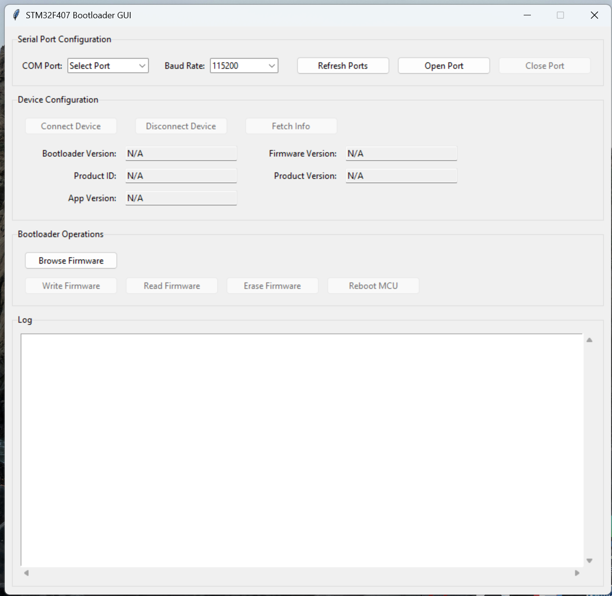

# Blackshield Bootloader 


### Developed for STM32F407. Bootloader's size is 28Kb on STM3232F407

### Jumps to location 0x08010000 where application sits.


### Update system_stm32f4xx.c 

```C

#define USER_VECT_TAB_ADDRESS //Uncomment this line

#if defined(USER_VECT_TAB_ADDRESS)
/*!< Uncomment the following line if you need to relocate your vector Table
     in Sram else user remap will be done in Flash. */
/* #define VECT_TAB_SRAM */
#if defined(VECT_TAB_SRAM)
#define VECT_TAB_BASE_ADDRESS   SRAM_BASE       /*!< Vector Table base address field.
                                                     This value must be a multiple of 0x200. */
#define VECT_TAB_OFFSET         0x00000000U     /*!< Vector Table base offset field.
                                                     This value must be a multiple of 0x200. */
#else
#define VECT_TAB_BASE_ADDRESS   FLASH_BASE      /*!< Vector Table base address field.
                                                     This value must be a multiple of 0x200. */
#define VECT_TAB_OFFSET         0x00010000U     /*!< Vector Table base offset field.
                                                     This value must be a multiple of 0x200. */
#endif /* VECT_TAB_SRAM */
#endif /* USER_VECT_TAB_ADDRESS */


```

### Update STM32F407GTX_FLASH.ld linker file

```ld
MEMORY
{
  CCMRAM    (xrw)    : ORIGIN = 0x10000000,   LENGTH = 64K
  RAM    (xrw)    : ORIGIN = 0x20000000,   LENGTH = 128K
  FLASH    (rx)    : ORIGIN = 0x8010000,   LENGTH = 448K 
}

```

### Application size needs to be updated in the linker file of the bootloader and application. 

### Run the PC application to flash the processor




### Command Structure

```
     ___________________________________________________________________
     |                |          |          |         |                 |              
     | Start of Frame |  Command | Length   | Payload | End of Frame    |
     |________________|__________|__________|_________|_________________|

     Start of Frame: 0xAA 0x55
     Command: 0xA0 - 0xA6
     Length: 0-255
     Payload: data[0] - data[255]
     End of Frame: 0xBB 0x66

```
### Boot and Application Data

16 bytes are reserved for Application Configuration
4 bytes for Application length in bytes
4 bytes for Application CRC in
1 byte for Firmware Version
1 byte for Product ID
1 byte for Product Version
1 byte for App version


```ld
MEMORY
{
  CCMRAM    (xrw)    : ORIGIN = 0x10000000,   LENGTH = 64K
  RAM    (xrw)    : ORIGIN = 0x20000000,   LENGTH = 128K
  APP_SPACE    (rx)    : ORIGIN = 0x08010000,   LENGTH = 64K 
  APP_CONFIG(rw) : ORIGIN =  0x0801FFF0,  LENGTH = 16
  
}

```